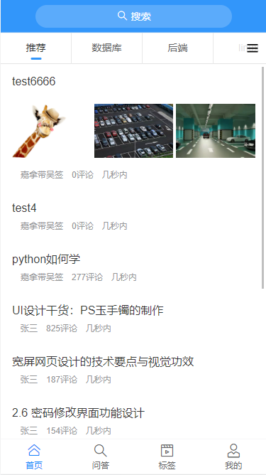
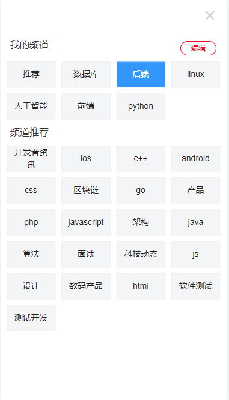
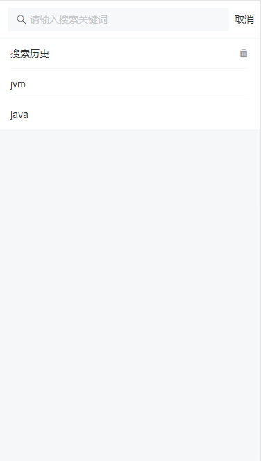
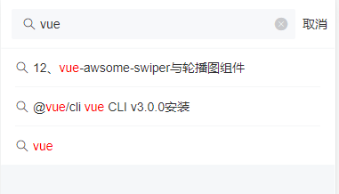
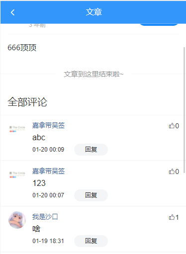
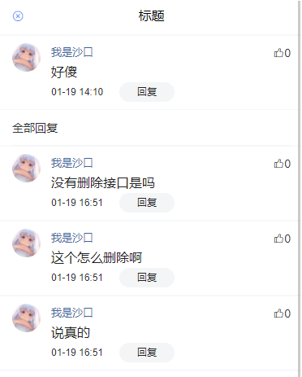
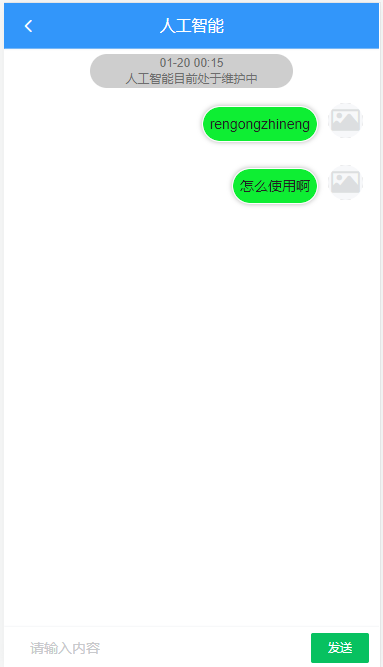

# Toutiao-技术论坛

## 简介

一个仿造今日头条的技术推送app/h5应用。

**接口地址**：http://api-toutiao-web.itheima.net

接口文档：在根目录下存放

教程地址：https://www.bilibili.com/video/BV1bg411V769

测试访问地址：http://47.113.121.220/

app下载地址：同样 存放在根目录的app打包文件下


**测试app请确保权限中的联网权限已开启**
**测试账号：手机可任意，万能验证码：246810


目前功能：登录、注册、浏览接口返回的文章数据，文章详情，tag标签查询详情，评论，二级评论，点赞，收藏文章，编辑个人资料，搜索，记录搜索历史，编辑频道、展示收藏列表、搜索跳转，

待完善功能：聊天室，展示浏览记录，完善问答页面布局，完善小功能模块，展示粉丝列表，展示关注列表。。。。。

目前已知：小智同学接口失效，出现跨域错误无法使用websocket。

update 2022.1.21 :

新增天气页面、学习计划页面

## 项目展示

首页



编辑tag 频道



搜索页



文章详情


评论详情  包含二级评论



人工智能对话（仅画面）



*update 2022.1.20*


## 安装依赖

```
npm install
```

### 启动项目
```
npm run serve
```

### 构建项目打包生成静态文件夹
```
npm run build
```

### 启用语法检查
```
npm run lint
```

# 
