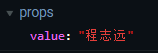
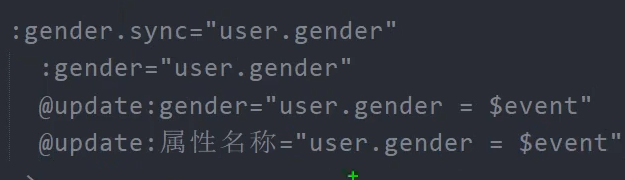
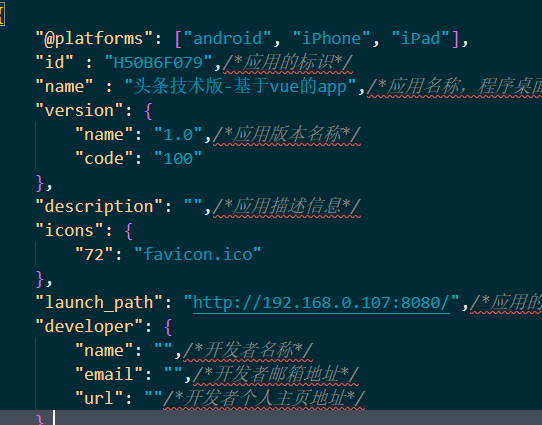

# 黑马头条-移动端h5项目

项目教程地址：https://www.bilibili.com/video/BV1bg411V769

项目接口文档：http://toutiao.itheima.net/api.html

项目接口地址：http://toutiao.itheima.net

## ch01 移动端的适配

移动的适配，头条项目使用了vant作为移动端ui框架，使用vant即可

```js
import Vant from 'vant';
import 'vant/lib/index.css';

Vue.use(Vant)
```

同时使用了淘宝的flexible包以及postcss-pxtorem

```shell
npm i amfe-flexible
npm i postcss-pxtorem@5 -D
```

配置postcss.config.js

```js
// postcss.config.js
module.exports = {
    plugins: {
        'autoprefixer': {
            browsers: ['Android>=4.0', 'iOS >= 8']
        },
        'postcss-pxtorem': {
            rootValue: 37.5,
            propList: ['*'],
        },
    },
};
```

重启服务

这样就可以适配移动端了，所有的px都会自动转换为rem


## postcss介绍

postcss可以对css进行处理，有众多的插件，我们可以通过postcss去实现各种不一样的功能。

中文官方网站：https://www.postcss.com.cn/

需要增加插件，就要在postcss.config.js中进行配置

vue-cli会自动为我们集成一个autoprefixer，因此在上面的配置会导致我们的vue出现警告。去掉即可。

因此需要配置需要兼容的平台，去到package.json去修改

```js
"browserslist": [
    "> 1%",
    "last 2 versions",
    "not dead"
  ]
```

即可

其实默认的list就可以了，当然也可以自己去配置，例如我们需要兼容移动端，就去加上Android或者ios。

### pxtorem配置解释

```js
plugins: {
    'postcss-pxtorem': {
        // 根据设计稿的宽度来进行决定
        // 如果设计稿的设计宽度为375 则设为37.5
        // 如果设计稿的设计宽度为750 则设为750
        rootValue: 37.5,
        propList: ['*'],
    },
},
```

因为vant的ui组件时根据375的宽度来进行设计的，所以我们这里设置为37.5即可。

## fonticon详细引用

通过fontclass来进行使用

生成链接后，加载进项目即可。

引入后，使用需要注意两点：

- app.vue上面要引入

- ```js
  import './styles/index.css';
  ```

- 第二 使用的时候记得加上前缀类名

- ```html
  <i class="iconfont icon-dianzan"></i>
  ```

### vant中的icon

```html
<!-- 基本展示 -->
<van-icon name="chat-o" />

<!-- 设置dot属性后，会在图标右上角展示一个小红点 -->
<van-icon name="chat-o" dot />

<!-- 设置badge属性后，会在图标右上角展示相应的徽标 -->
<van-icon name="chat-o" badge="9" />
```


## 每个项目都需要的 封装axios

```js
import axios from 'axios'

axios.create({
    baseURL:'http://toutiao.itheima.net',
    timeout:5000
})

// 请求拦截器


// 相应拦截器


// 导出
export default request;
```


## vant 表单里面放按钮

```html
<van-field v-model="value" 
           left-icon=""
           placeholder="请输入验证码" >
    <template #button>
        <van-button size="small" round >获取验证码</van-button>
    </template>
</van-field>
```

通过template和#button属性，我们可以在表单里面放置一个小按钮。

## this.$toast

可以显示一个加载的方框动画，可以让我们在进入的时候显示加载的动画。


## 表单验证 

需要用到vant的表单验证，需要给field包裹上一层form

并且把事件绑定在表单的@submit事件上。

```html
<van-field v-model="user.mobile" class="iconfont" icon-prefix="icon" left-icon="shouji"
                    placeholder="请输入手机号"
                    :rules="[{required:true,message:'请输入手机号！'}]" />
```

在rules中动态绑定表单验证规则。

当然不推荐像上面这样来进行绑定

通过下面的方式来进行绑定比较推荐

```js
formRules: {
    mobile: [{
        required: true,
        message: "请输入手机号！",
        trigger: "onBlur"
    },
             {
                 pattern: /^1{3,5,7,8,9}\d{9}$/,
                 message: "请输入正确的手机号！",
                 trigger: "onBlur"
             }
            ],
        code:[
            {
                required: true,
                message: "请输入验证码！",
                trigger: "onBlur"
            },
            {
                pattern: /\d{6}$/,
                message: "请输入正确的验证码！",
                trigger: "onBlur"
            }
        ]
}
```

## token过期

在返回的数据中，还包含着一个refreshtoken，称作刷新令牌。

token的有效期只有两个小时，但是另一个刷新令牌的有效期为14天，用于令牌过期之后重新获取新的访问令牌。

## 拦截器的设置

老生常谈的拦截器设置

需要添加拦截器

```js
//请求拦截器  发请求之前，拦截器可以监测到
request.interceptors.request.use((config) => {
    //config 配置对象 
    const {user} = store.state
    if (user) {
        config.headers.Authorization = `Bearer ${user.token}`
    }
    return config;
})
```

## /deep/解释

 之前在样式不起作用的时候用了这个/deep/其实这个是一个样式作用域的问题。

默认我们的样式，是全局样式，如果不希望当前组件中的样式影响别的样式。

就可以添加一个作用域，我们之前也经常用到。也就是style里的scoped

/deep/ 深度作用操作符。

可以让我们的样式作用的更深。因为我们增加的类名，优先级不一定有原本的子类高。本来我们的类名只能作用到根节点，通过这个操作符可以让样式作用到span这些节点上。

## dayjs 如何计算相对时间

```js
// 封装dayjs库
import dayjs from 'dayjs'
import 'dayjs/locale/zh-cn'

import relativeTime  from 'dayjs/plugin/relativeTime'
import Vue from 'vue'
dayjs.extend(relativeTime)

// 使用中文语言包
dayjs.locale('zh-cn')

Vue.filter('xianduiTime',value=>{
    return dayjs(value).from(dayjs())
})
```

先初始化，把处理相对时间的代码，封装为全局过滤器、

就可以在项目中进行使用了。

记得要在main.js中引用

```js
import '@/utils/dayjs'
```

## 子传父另一种方法

通过emit来通知父亲，在组件上使用事件绑定来进行触发

```html
<channel-edit :channels="channels" @close="isChannelEditShow=false"></channel-edit>
```


## 联想建议条

使用lodash进行节流防抖 防止过快的请求。

```js
handler : debounce(async function(){
    const {data}=await getSuggestion(this.searchText);
    this.searchSuggestList=data.data.options;
},1000)
```


## 通过正则表达式处理网页内容

```js
hightlight(suggestion){
    const reg=new RegExp(this.searchText,gi);
    return suggestion.replace(reg,`<span style="color:red;>${this.searchText}</span>`)
}
```


## 编辑用户模块

如何将prop绑定到表单上并修改？

新建一个localName，并将prop值附上；


## 给子组件用v-mode

当我们父子组件都有需要用到的数据时，可以直接给子组件一个v-model,

父组件会给子组件传一个value，默认会监听@input事件。



修改value，父组件会监听这个value 的变化。

如果我们有多个属性需要父子组件同步，可以使用.sync操作符。

```html
<update-name v-model="user.name" 
            :gender.sync="user.gender"
```

这个sync可以有任意个。



子组件发送的时候必须要用

```js
this.$emit('update:gender')
```


## 关于上传图片

```html
<input type="file" accept="image/*" 
       @change="onFileChange"
       hidden ref="imgUpload">
<van-cell title="头像" @click="$refs.imgUpload.click()" value="内容" is-link center>
    <van-image  :src="user.photo"
               fit="cover" round width="35" height="35" />
</van-cell>
```


```js
onFileChange(){
    console.log('触发');
    this.$refs.imgUpload.value=''
}
```

通过每次设置value，即使选择相同图片也能触发change事件

如何选择图片并生成URL连接呢？

使用window.URL.ccreateObjectURL

通过这个方法，可以生成一个blob连接，可以将上传的文件对象转换url数据并使用，

```js
onFileChange() {
    this.isPhotoShow=true;
    // 触发弹出层 预览图片
    const blob=window.URL.createObjectURL(this.$refs.imgUpload.files[0]);
    this.previewPicture=blob;

    this.$refs.imgUpload.value = ''
}

```

上传图片，我们需要提交formdata的数据对象，不能提交{}

因此我们要去new一个formData

我们在传送的时候，直接将imgUpload的文件对象传给子组件

```js
const blob=this.$refs.imgUpload.files[0];
```

```js
//子组件
async onConfirm() {
    this.$toast.loading({
        title: '上传中~~~',
        forbidclick: true
    })
    const fd = new FormData();
    // 传入文件对象并转成formData
    fd.append('photo', this.file)
    await updateUserPhoto(fd)
    this.$toast.success('上传成功！');
    this.$emit('close');
    this.$emit('update-photo',this.photo);
}
```


## 裁剪插件

cropper.js

https://github.com/fengyuanchen/cropperjs

使用纯js实现的裁切插件，可以不依赖框架进行使用，直接用就完事了。

### Installation

```
npm install cropperjs
```

In browser:

```
<link  href="/path/to/cropper.css" rel="stylesheet">
<script src="/path/to/cropper.js"></script>
```

[cdnjs](https://github.com/cdnjs/cdnjs) provides CDN support for Cropper.js's CSS and JavaScript. You can find the links [here](https://cdnjs.com/libraries/cropperjs).

### Usage

#### Syntax

```
new Cropper(element[, options])
```

- **element**

  - Type: `HTMLImageElement` or `HTMLCanvasElement`
  - The target image or canvas element for cropping.

- **options** (optional)

  - Type: `Object`
  - The options for cropping. Check out the available [options](https://github.com/fengyuanchen/cropperjs#options).

  ```js
  import Cropper from 'cropperjs';
  import 'cropperjs/dist/cropper.css';
  ```

引入

```js
mounted(){
    const image = this.$refs.image;
    const cropper = new Cropper(image, {
        aspectRatio: 16 / 9,
        crop(event) {
            console.log(event.detail.x);
            console.log(event.detail.y);
            console.log(event.detail.width);
            console.log(event.detail.height);
            console.log(event.detail.rotate);
            console.log(event.detail.scaleX);
            console.log(event.detail.scaleY);
        },
    });
},
```

把图片包装到块元素里面

```html
<div>
    
</div>
```

设置样式

```css
.img{
    display: block;
    max-width: 100%;
}
```

可以使用了，设置一下config

```js
const cropper = new Cropper(image, {
    viewMode:1,
    dragMode:'move',
    aspectRatio:1,
    autoCropArea:1,
    cropBoxMovable:false,
    cropBoxResizable:false,
    background:false,
    movable:true
});
```


```js
getCroppedCanvas(){
    return new Promise(resolve=>{
        this.cropper.getCroppedCanvas().toBlob((blob)=>{
            resolve(blob)
        })
    })
},
```

封装到promise中，这个可以获取到裁剪后的文件数据。


## websocket

websocket对比http，不需要我们的客户端一直去请求服务端才能获取数据，可以双向平等对话。

websocket 可以单独拎出来 到时再单独进行学习。

模型：建立连接--发送消息，然后关闭连接。


## scoket.io

首先安装

```shell
npm i socket.io-client
```


## 性能优化

keepalive

组件缓存。我们可以通过keepalive进行组件的缓存，不要随着路由切换而被销毁。

缓存带来了一些好处，但也带来了一些问题，我们每次点击该路由出口的组件时，组件的生命周期都不会触发。

- 登录其他账号后缓存仍然存在
- 点击文章子组件也一并被缓存

针对问题二 可以通过include来解决：

```html 
<keep-alive :include="['layout']">
    <router-view />
</keep-alive>
```

而针对问题1 可以通过vuex来进行缓存页面的添加与移除

例如我们设置一个cachepages，在需要缓存的时候将页面加入到cachepages，在需要移除缓存的时候从vuex中移除

在登录跳转前，我们就可以去移除一下缓存，达到跳转的时候清除缓存的功能。


### 记住滚动位置

通过注册滚动事件 获取到滚动位置。

然后存到一个变量中，每次组件切换后，通过activated，来滚动到指定的位置。

```js
activated(){
    this.$refs['article-list'].scrollTop=this.scrollTop
},
```

## 解决token过期

通过设置响应拦截器来实现。

首先我们先通过响应拦截器去处理常见的错误码：

```js
// 响应失败
request.interceptors.response.use((response) => {
    return response;
},async  function (error) {
    const status = error.response.status;
    if(status==400){
        // 参数错误
        Toast.fail('请求参数错误~')
    }else if (status == 401) {
        // token无效
        // 如果没有user 则跳转登录页重新登录
        // 有user  拿着刷新token去重新登录
        const {user}=store.state;
        if(!user||!user.token){
            // 未登录 重新登录
            redirectLogin()
        }else{
            try {
                const {data}=await refreshTokenReq({
                    url: '/app/v1_0/authorizations',
                    method:"PUT",
                    headers:{
                        Authorization:`Bearer ${user.refresh_token}`
                    }
                })
                user.token=data.data.token;
                store.commit('SETUSER',user);
                // 处理完usertoken 重新发起请求
                return request(error.config);
            } catch (error) {
                // 刷新失败 直接跳转登录页
                Toast.fail('登录验证失败，请重新登录~');
                store.state.user=null;
                store.commit('REMOVECACHEPAGE','layout');
                redirectLogin()
            }
        }
    } else if (status == 403) {
        // 无权限
        Toast.fail('您没有权限~')
    }else if(status>=500){
        // 服务端异常
        Toast.fail('服务端出现异常~')
    }
    
    return Promise.reject(error)
})
```

```js
else if (status == 401) {
    // token无效
    // 如果没有user 则跳转登录页重新登录
    // 有user  拿着刷新token去重新登录
    const {user}=store.state;
    if(!user||!user.token){
        // 未登录 重新登录
        redirectLogin()
    }else{
        try {
            const {data}=await refreshTokenReq({
                url: '/app/v1_0/authorizations',
                method:"PUT",
                headers:{
                    Authorization:`Bearer ${user.refresh_token}`
                }
            })
            user.token=data.data.token;
            store.commit('SETUSER',user);

        } catch (error) {
            // 刷新失败 直接跳转登录页
            Toast.fail('登录验证失败，请重新登录~');
            store.state.user=null;
            store.commit('REMOVECACHEPAGE','layout');
            redirectLogin()
        }
    }
}
```

由于我们的响应token失效码是401，而刷新token失效的错误码也是401，因此要封装一个新的axios，区别我们原来封装的request。

```js
const refreshTokenReq=axios.create({
    baseURL:'http://api-toutiao-web.itheima.net',
})
```

通过封装一个重定向的函数，来让我们直接跳转登录页

```js
function redirectLogin(){
    router.replace('/login')
}
```


## 打包 发布 app

使用dcloud 来进行打包。

首先我们需要复制hbuilder的manifest.json复制到我们项目中的manifest.json

并且设置icon和地址，地址要设置为局域网地址，不能设置为localhost



配置launch_path  需要其他人进行运行需要配线上地址。


